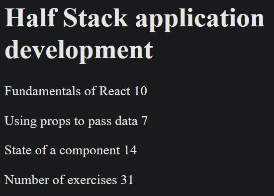
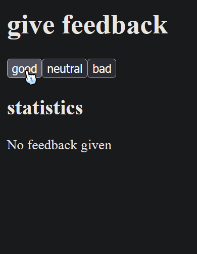
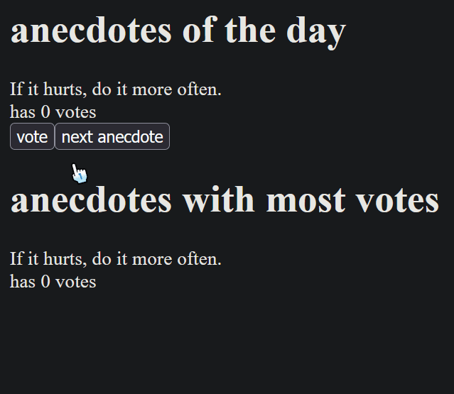

# Part 1 Summary

This introduction to React 19 has taught me about:

- Writing components using ES6 and JSX
- Component state and the `useState` hook
- Page re-rendering with state changes and responding to events
- Passing state and event handlers (including objects and arrays) to child components

## courseinfo

  

## unicafe

  

## anecdotes

  

