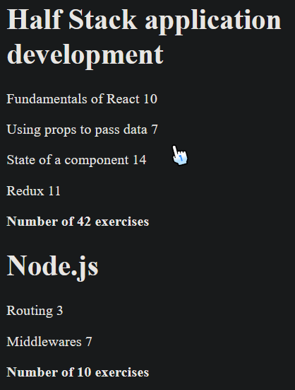
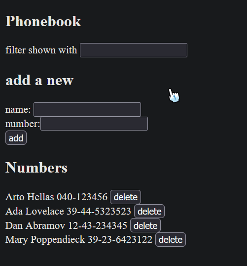
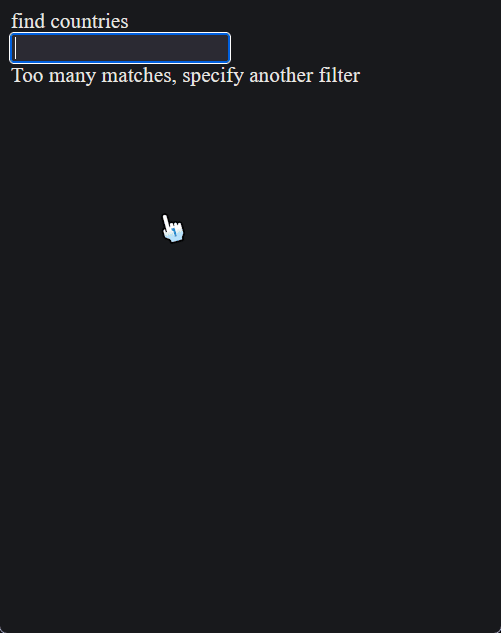

# Part 2 Summary

In this part, we created simple data-driven applications, I learned about:

- Rendering collections and dynamics list with .map(), .filter(), .some()
- Creating basic forms with react to use user input
- Connecting to a backend by simulating a REST API with json-server (npx json-server --port 3001 db.json)
  and using axios to fetch, add, and update data asynchronously with Promises
- Styling React apps

## courseinfo

## phonebook

## countries

