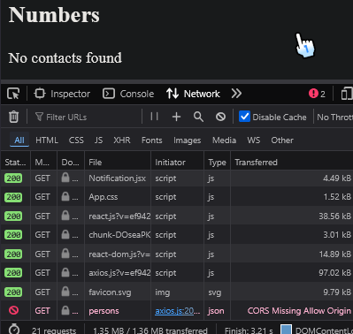

# Make the backend work with the phonebook frontend

## what we have

- front: commit "exercice 2.17" in ~~/part2/phonebook
- back: commit "exercice 3.8" in ~~/part3/phonebookBackend

the front:

- is run on http://localhost:5173/
- fetch data using [server-json](https://github.com/typicode/json-server) on baseUrl = "http://localhost:3001/persons";

the back:

- is run on http://localhost:3001/api/persons
- data is on persons[] (in memory)

## first attempt

if we change front baseUrl to call the back we are met with CORS error


a solution to this is allowing cors

```js
const cors = require("cors");
app.use(cors());
```


# Deploy our app to the internet

render.com free tier allow us to host our simple API on the web
on it we create a new web service and connect render to our repo

apply: const PORT = process.env.PORT || 3001
